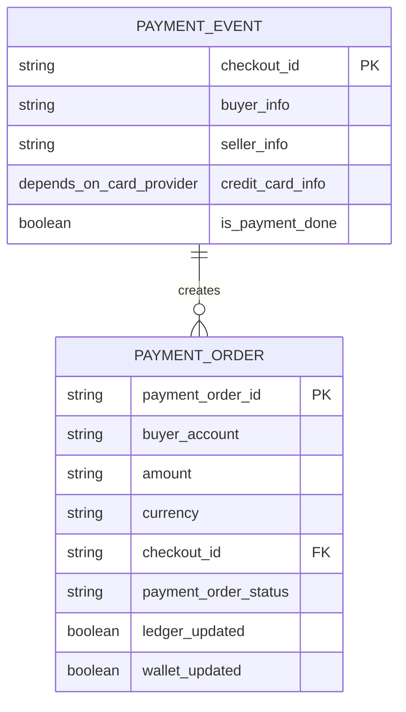

# sd-payment-system

## DB

## Thoughts
- Simplify `payment_event`, `payment_order` into one table for interview purpose
- `payment_order`, `ledger`, `wallet` in the same service/database, so that we can use transaction to ensure consistency -> introduce lock, deadlock