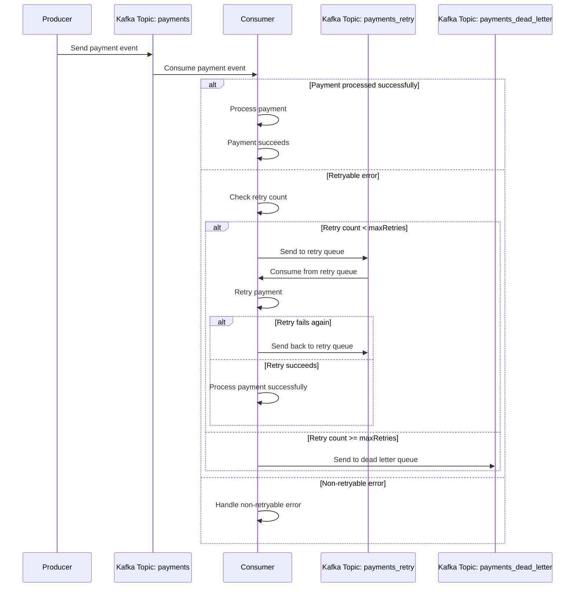

# Sequence

```mermaid
sequenceDiagram
    participant Producer
    participant PaymentsTopic as Kafka Topic: payments
    participant Consumer
    participant RetryQueue as Kafka Topic: payments_retry
    participant DeadLetterQueue as Kafka Topic: payments_dead_letter

    Producer->>PaymentsTopic: Send payment event
    PaymentsTopic->>Consumer: Consume payment event
    
    alt Payment processed successfully
        Consumer->>Consumer: Process payment
        Consumer->>Consumer: Payment succeeds
    else Retryable error
        Consumer->>Consumer: Check retry count
        alt Retry count < maxRetries
            Consumer->>RetryQueue: Send to retry queue
            RetryQueue->>Consumer: Consume from retry queue
            Consumer->>Consumer: Retry payment
            alt Retry fails again
                Consumer->>RetryQueue: Send back to retry queue
            else Retry succeeds
                Consumer->>Consumer: Process payment successfully
            end
        else Retry count >= maxRetries
            Consumer->>DeadLetterQueue: Send to dead letter queue
        end
    else Non-retryable error
        Consumer->>Consumer: Handle non-retryable error
    end
```