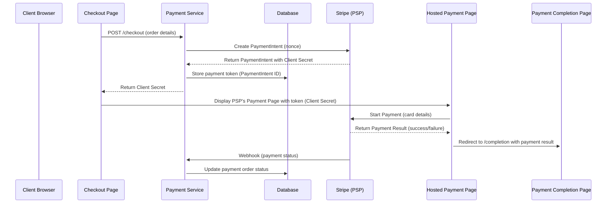

# Sequence

```mermaid
sequenceDiagram
    participant Client Browser
    participant Checkout Page
    participant Payment Service
    participant Database
    participant Stripe (PSP)
    participant Hosted Payment Page
    participant Payment Completion Page

    Checkout Page->>+Payment Service: POST /checkout (order details)
    Payment Service->>Stripe (PSP): Create PaymentIntent (nonce)
    Stripe (PSP)-->>Payment Service: Return PaymentIntent with Client Secret
    Payment Service->>Database: Store payment token (PaymentIntent ID)
    Payment Service-->>Checkout Page: Return Client Secret
    
    Checkout Page->>+Hosted Payment Page: Display PSP's Payment Page with token (Client Secret)
    Hosted Payment Page->>Stripe (PSP): Start Payment (card details)
    Stripe (PSP)-->>Hosted Payment Page: Return Payment Result (success/failure)
    Hosted Payment Page->>+Payment Completion Page: Redirect to /completion with payment result
    
    Stripe (PSP)->>Payment Service: Webhook (payment status)
    Payment Service->>Database: Update payment order status
```